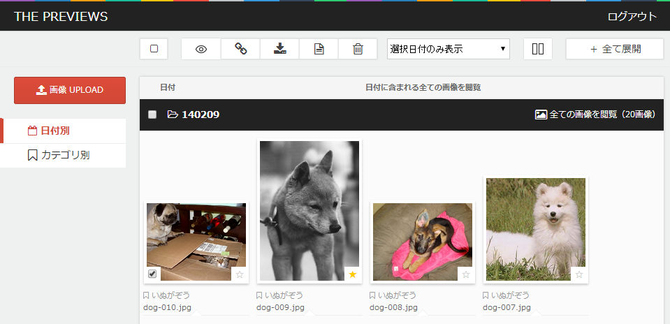

# THE PREVIEWS

## 概要
デザインカンプのプレビューツール

## 動作環境
PHP バージョン 5.2.4 以上

## 初期設定
1. ダウンロード後、config.php のユーザ名・パスワードを変更
2. サーバに配置
3. 下記、ディレクトリとファイルのパーミッションを777に変更
<pre>
/data/  
/data/img/  
/data/thumbnail/  
/data/db.csv  
/data/category.csv  
/data/config.csv  
</pre>
4. ブラウザから配置ディレクトリにアクセス
5. ページ右上「ログイン」をクリック、遷移後、1で設定したユーザ名・パスワードでログイン
6. サンプル画像がいらない場合は全削除
7. サンプルカテゴリがいらない場合は、管理画面から削除

## ログイン前にできること
・公開フラグ（★）のついた画像の閲覧  
・選択した画像のダウンロード

## ログイン後にできること
・全ての画像の閲覧  
・画像の投稿  
・画像の削除  
・画像のリネーム  
・公開フラグ（★）の設定  
・選択した画像のダウンロード  
・画像へのメモ追加  
・カテゴリの追加  
・サイト名の変更  
・ヘッダの背景とテキスト色の変更

## License MIT

© 2014 umesan

Permission is hereby granted, free of charge, to any person  
obtaining a copy of this software and associated documentation  
files (the "Software"), to deal in the Software without  
restriction, including without limitation the rights to use,
copy, modify, merge, publish, distribute, sublicense, and/or sell
copies of the Software, and to permit persons to whom the
Software is furnished to do so, subject to the following
conditions:

The above copyright notice and this permission notice shall be
included in all copies or substantial portions of the Software.

THE SOFTWARE IS PROVIDED "AS IS", WITHOUT WARRANTY OF ANY KIND,
EXPRESS OR IMPLIED, INCLUDING BUT NOT LIMITED TO THE WARRANTIES
OF MERCHANTABILITY, FITNESS FOR A PARTICULAR PURPOSE AND
NONINFRINGEMENT. IN NO EVENT SHALL THE AUTHORS OR COPYRIGHT
HOLDERS BE LIABLE FOR ANY CLAIM, DAMAGES OR OTHER LIABILITY,
WHETHER IN AN ACTION OF CONTRACT, TORT OR OTHERWISE, ARISING
FROM, OUT OF OR IN CONNECTION WITH THE SOFTWARE OR THE USE OR
OTHER DEALINGS IN THE SOFTWARE.
